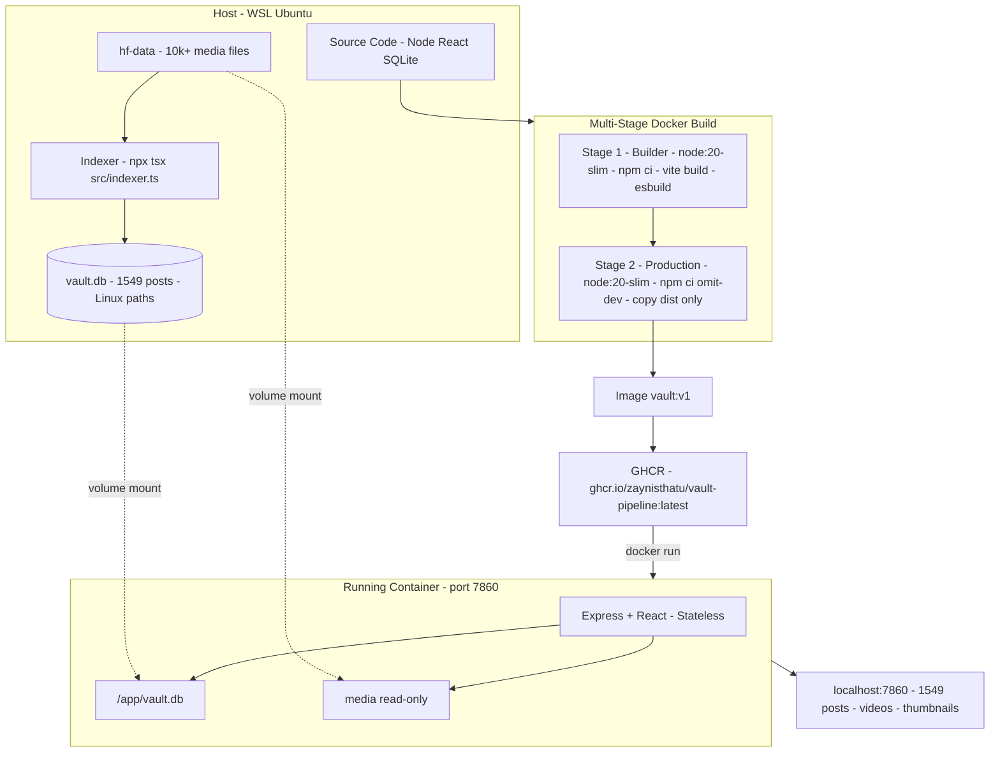
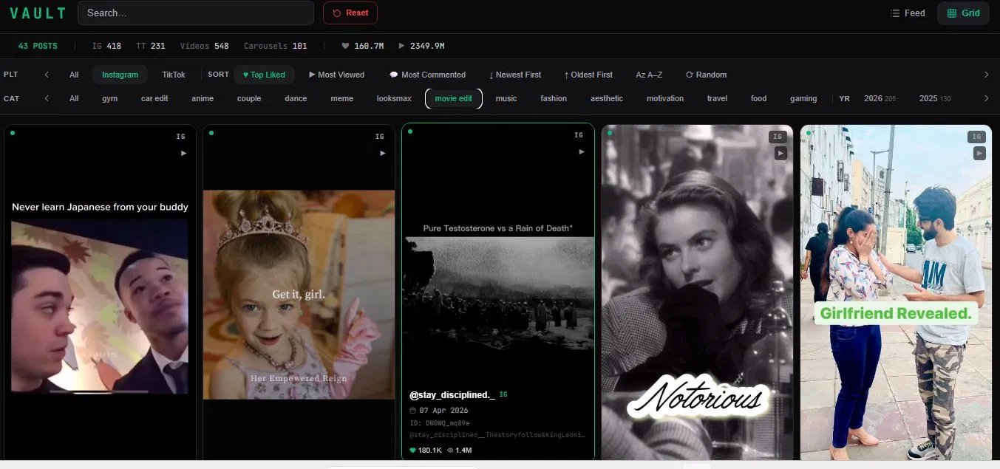
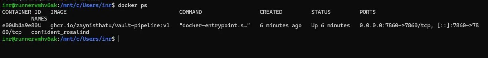
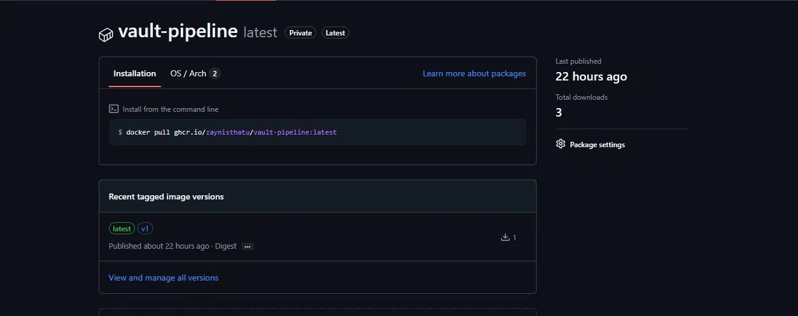
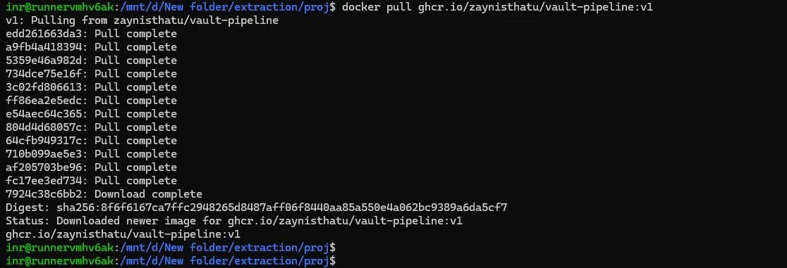

# VAULT — DevOps Pipeline


A full-stack social media archive viewer containerized and deployed through a production-grade DevOps pipeline — multi-stage Docker builds, Kubernetes orchestration, GitOps, observability, autoscaling, and CI/CD.

---

## Highlights

- ✅ Multi-stage Docker build on `node:20-slim` — native C++ module (`better-sqlite3`) compiled at build time
- ✅ Stateless container architecture — DB and media externalized as volumes (PersistentVolumeClaim-ready)
- ✅ Image published to GHCR
- ✅ ESM/CJS interop resolved — esbuild CJS output with `"type":"module"` package
- ✅ 3-node k3d Kubernetes cluster — 2 replicas behind a Traefik Ingress at `vault.local`
- ✅ Health checks decoupled from application state — dedicated `/healthz` probe, no CrashLoopBackOff
- ✅ NetworkPolicy and PodDisruptionBudget (`minAvailable: 1`) applied
- ✅ Runtime-validated — video streaming, thumbnails, and post search live under load

---

## Quick Start

```bash
# 1. Index your media (one-time, run on host/WSL)
npx tsx src/indexer.ts --folder "/your/linux/path/to/media"

# 2a. Run standalone (Stage 1)
docker run -p 7860:7860 -e PORT=7860 \
  -v "/path/to/vault.db:/app/vault.db" \
  -v "/your/media:/your/media:ro" \
  ghcr.io/zaynisthatu/vault-pipeline:latest

# 2b. Run on Kubernetes (Stage 2)
kubectl apply -f k8s/
kubectl get pods -n vault
# add "127.0.0.1  vault.local" to /etc/hosts, then:
curl http://vault.local/healthz

# 3. Open http://localhost:7860 (standalone) or http://vault.local (k8s)
```

---

## What Is VAULT?

VAULT is a self-built local archive viewer for Instagram and TikTok content — full video streaming, thumbnails, metadata search.

| Layer | Technology |
|-------|-----------|
| Backend | Node.js + Express + TypeScript |
| Frontend | React 19 + Vite + Tailwind CSS v4 |
| Database | SQLite via `better-sqlite3` (native C++ addon) |
| Bundler | esbuild (server) + Vite (frontend) |
| Registry | GHCR — `ghcr.io/zaynisthatu/vault-pipeline` |
| Orchestration | k3d (3-node) — Traefik Ingress, NetworkPolicy, PodDisruptionBudget |

---

## Architecture



---

## Screenshots

### App — Live at localhost:7860


### Container Running


### GHCR — Image Published


### Docker Build — Success


### Indexer Output


---

## Pipeline Stages

| Stage | Focus | Status |
|-------|-------|--------|
| **1 — Containerization** | Multi-stage Docker build · GHCR push · stateless architecture | ✅ Complete |
| **2 — Kubernetes** | 3-node k3d cluster · Traefik Ingress · NetworkPolicy · PodDisruptionBudget | ✅ Complete |
| 3 — GitOps | ArgoCD · declarative sync · auto-deploy on git push | ⏳ |
| 4 — Reliability | Rolling updates · rollback · zero-downtime deploy | ⏳ |
| 5 — Observability | Prometheus · Grafana · Loki | ⏳ |
| 6 — Alerting | Slack webhook · alert rules | ⏳ |
| 7 — Storage | LocalStack S3 · media backend abstraction | ⏳ |
| 8 — Config Mgmt | Ansible · automated environment setup | ⏳ |
| 9 — Autoscaling | HPA · load testing · scale events | ⏳ |
| 10 — CI/CD | GitHub Actions · automated build + push + deploy | ⏳ |
| 11 — Secrets | Sealed Secrets · encrypted at rest in git | ⏳ |
| 12 — Security | Trivy · image vulnerability scanning | ⏳ |

---

## Documentation

- [Stage 1 — Containerization](docs/stage-1-containerization.md)
- [Stage 2 — Kubernetes Orchestration](docs/stage-2-kubernetes.md)

---

## License

MIT