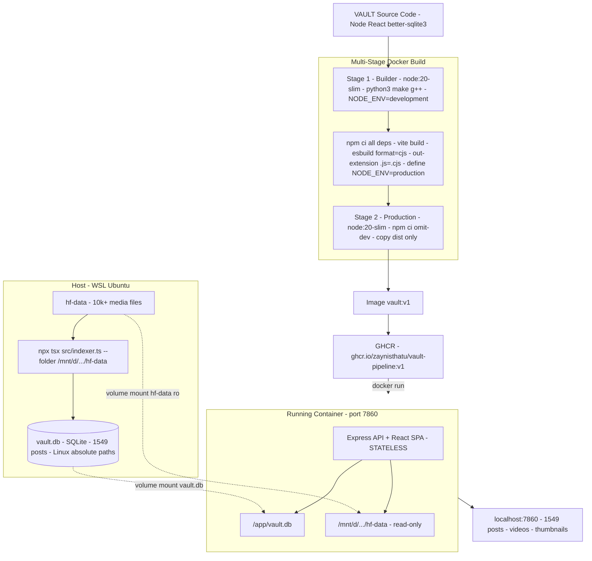
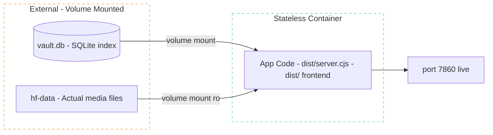
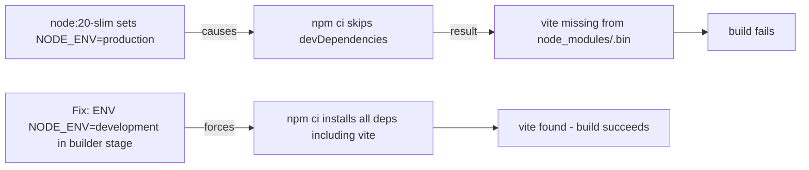
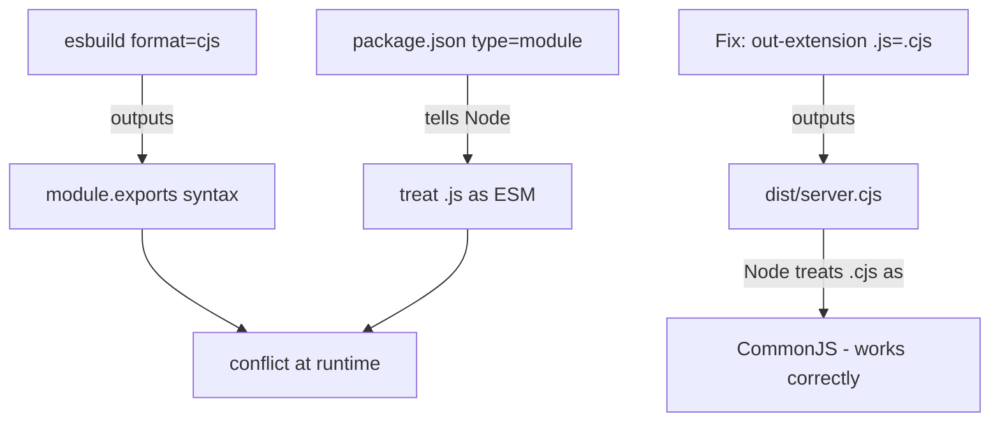
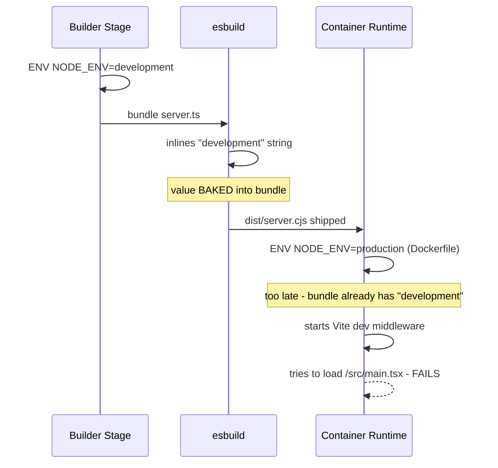
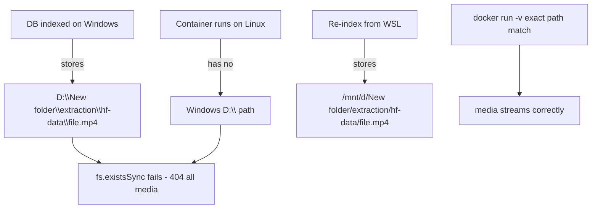
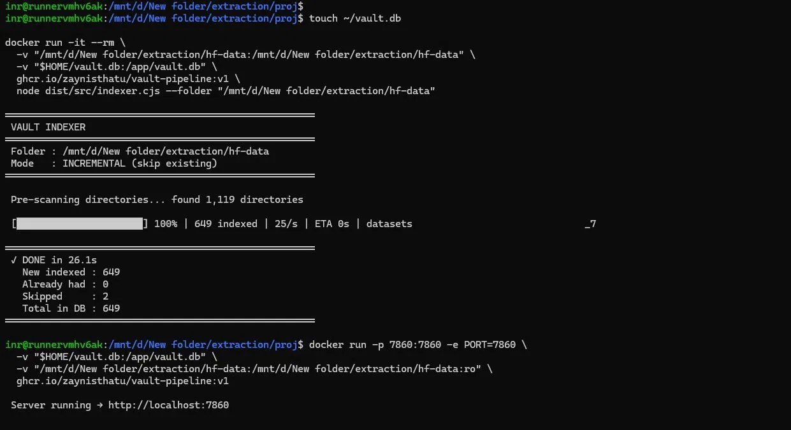
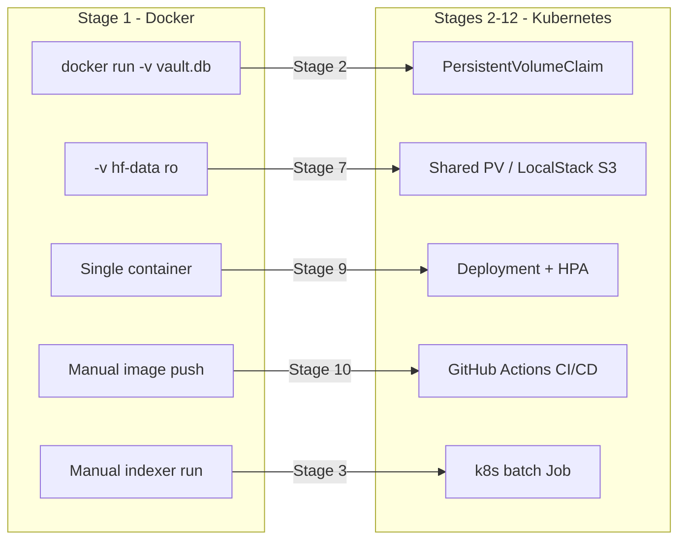

# Stage 1 — Containerization

**Objective:** Package VAULT as a portable, stateless container image with an externalized data layer.

**Outcome:** Multi-stage Docker build pushed to GHCR, runtime-validated with 1,549 posts, videos, and thumbnails streaming live.

---

## Architecture



### Stateless Container Design



> Container owns zero persistent state. DB and media are external volumes — this same pattern becomes a `PersistentVolumeClaim` in Stage 2 (Kubernetes).

---

## Engineering Challenges & Resolutions

### Challenge 1 — `vite: not found` during build

```
sh: 1: vite: not found
ERROR: failed to build: exit code 127
```



**Resolution:**
```dockerfile
# builder stage
ENV NODE_ENV=development
RUN npm ci
```

---

### Challenge 2 — `better-sqlite3` native compilation failure

```
gyp ERR! find Python  Python is not set
gyp ERR! not ok
npm error code 1
```

`better-sqlite3` is a native C++ addon compiled via `node-gyp`. Requires `python3`, `make`, `g++` — none present in `node:20-slim`.

**Resolution — both stages:**
```dockerfile
RUN apt-get update && apt-get install -y python3 make g++ \
    && rm -rf /var/lib/apt/lists/*
```

> Both builder and production stage require this — production `npm ci --omit=dev` also recompiles the native binding.

---

### Challenge 3 — ESM/CJS module conflict at runtime

```
ReferenceError: module is not defined in ES module scope
This file is being treated as an ES module because it has a '.js'
file extension and '/app/package.json' contains "type": "module".
```



**Resolution:**
```json
"build": "... esbuild ... --out-extension:.js=.cjs"
```
```dockerfile
CMD ["node", "dist/server.cjs"]
```

---

### Challenge 4 — `NODE_ENV` baked at build-time, not runtime

```
[vite] Pre-transform error: Failed to load url /src/main.tsx
Does the file exist?
```



`server.ts` checks `process.env.NODE_ENV` at runtime to decide between Vite dev-middleware and serving `dist/`. But esbuild **snapshots** the value at bundle time from the builder stage environment.

**Resolution:**
```json
"build": "... --define:process.env.NODE_ENV=\\\"production\\\""
```

---

### Challenge 5 — Videos and thumbnails returning 404

```
GET /video/1305  →  404 Video not found
GET /thumb/1305  →  404 Thumb not found
```



**Diagnosis:**
```bash
sqlite3 vault.db "SELECT video_path FROM posts LIMIT 1;"
# D:\New folder\extraction\hf-data\...  <- Windows path, broken on Linux
```

**Resolution:**
```bash
# Re-index from WSL — Linux absolute paths stored in DB
npx tsx src/indexer.ts --folder "/mnt/d/New folder/extraction/hf-data"

# Mount media at exact same path as stored in DB
docker run -p 7860:7860 -e PORT=7860 \
  -v "/path/to/vault.db:/app/vault.db" \
  -v "/mnt/d/New folder/extraction/hf-data:/mnt/d/New folder/extraction/hf-data:ro" \
  vault:v1
```

---

### Environment Setup Notes (WSL)

| Problem | Root Cause | Resolution |
|---------|-----------|------------|
| `node` not found in WSL | Only Windows `node.exe` on PATH | Install Linux Node 20 via NodeSource apt repo |
| `make` not found during `npm install` | WSL Ubuntu ships without build tools | `sudo apt-get install -y build-essential python3 make g++` |
| Wrong esbuild binary | `node_modules` installed on Windows — platform binaries incompatible | `rm -rf node_modules && npm install` on Linux |
| `npx tsx` using Windows binary | PATH resolving Windows `npx` first | `hash -r` after Linux node install |

---

## Final Dockerfile

```dockerfile
# Stage 1: Builder
FROM node:20-slim AS builder
WORKDIR /app

ENV NODE_ENV=development

RUN apt-get update && apt-get install -y python3 make g++ \
    && rm -rf /var/lib/apt/lists/*

COPY package*.json ./
RUN npm ci

COPY . .
RUN npm run build

# Stage 2: Production
FROM node:20-slim
WORKDIR /app

RUN apt-get update && apt-get install -y python3 make g++ \
    && rm -rf /var/lib/apt/lists/*

COPY package*.json ./
RUN npm ci --omit=dev

COPY --from=builder /app/dist ./dist
COPY --from=builder /app/index.html ./index.html

RUN echo '{"type": "commonjs"}' > ./dist/package.json

ENV NODE_ENV=production
ENV PORT=7860
EXPOSE 7860

CMD ["node", "dist/server.cjs"]
```

---

## Run Locally

```bash
# Step 1 — Generate database (one-time, run on host/WSL)
sudo apt-get install -y build-essential python3 make g++
npm install
npx tsx src/indexer.ts --folder "/your/linux/path/to/media"
```



```bash
# Step 2 — Run container
docker run -p 7860:7860 -e PORT=7860 \
  -v "/path/to/vault.db:/app/vault.db" \
  -v "/your/linux/path/to/media:/your/linux/path/to/media:ro" \
  ghcr.io/zaynisthatu/vault-pipeline:v1

# Step 3 — Open
# http://localhost:7860
```

> Media mount path must exactly match the path used during indexing — DB stores absolute paths.

---

## Production Equivalents



---

## Engineering Decisions & Rationale

**Why stateless container?** Container owns zero data — same image runs on laptop, VM, or 20 k8s pods with different volume sources. This is the foundation every subsequent stage builds on.

**Why index on host, not in container?** Indexing requires full devDependencies (`tsx`, `esbuild`, `better-sqlite3` build tools) — excluded from the production image by design. Indexing is a one-time data preparation step, not a runtime concern.

**Why absolute paths in DB?** `better-sqlite3` + `fs.existsSync()` requires resolvable paths at runtime. The constraint is: index path = mount path = DB stored path. In Stage 7, this is replaced with object storage (S3-equivalent) to eliminate path coupling entirely.

**Why `node:20-slim` over `node:20-alpine`?** Alpine uses musl libc — `better-sqlite3` (glibc-linked native addon) fails to compile on Alpine without significant workarounds. slim (Debian-based, glibc) works cleanly.