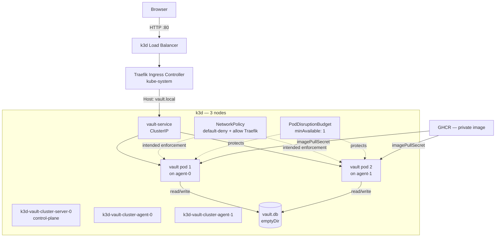
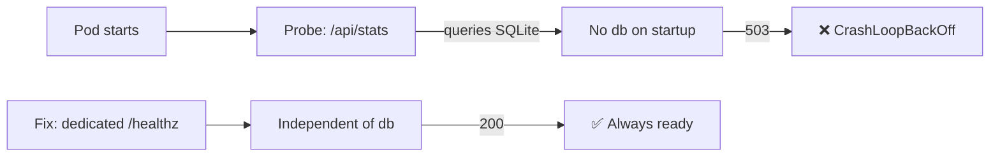
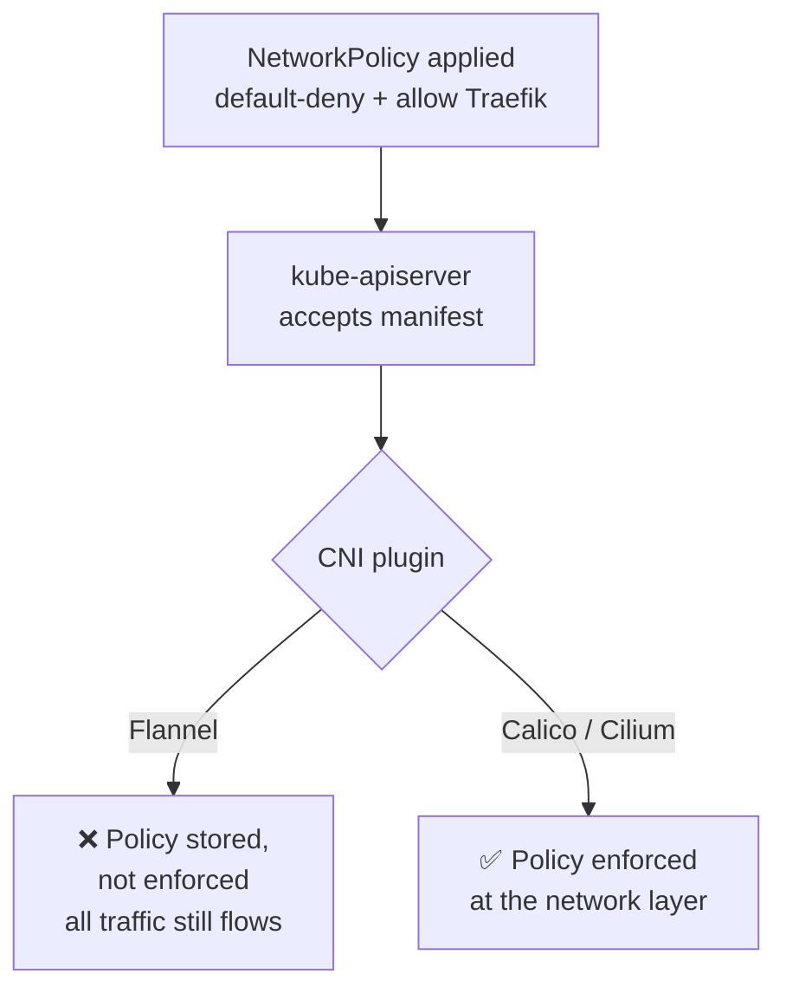

# Stage 2 — Kubernetes Orchestration

**Objective:** Move VAULT off a single Docker container onto a multi-node Kubernetes cluster with health-gated restarts, controlled ingress, network isolation, and guaranteed minimum availability during updates.

**Outcome:** 3-node k3d cluster running 2 replicas behind Traefik Ingress, readiness/liveness decoupled from application state, NetworkPolicy and PodDisruptionBudget applied, live at `vault.local`.

---

## Architecture



> Same topology shape as an EKS/GKE managed control plane — this becomes a direct migration target, not a rewrite, when Stage 6 moves to real cloud infrastructure.

---

## Engineering Challenges & Resolutions

### Challenge 1 — Readiness probe crash loop

```
NAME                          READY   STATUS             RESTARTS   AGE
vault-6b9585f4dc-m5nlz        0/1     CrashLoopBackOff   17         53m
vault-6b9585f4dc-zjgrv        0/1     CrashLoopBackOff   17         53m
```



The readiness probe was pointed at `/api/stats`, an existing endpoint that queries SQLite for a post count. On a fresh pod, `vault.db` doesn't exist yet — the query throws, the endpoint returns 503, the probe fails, Kubernetes kills the pod and restarts it. New pod, same missing db, same 503, indefinitely.

**Resolution:**
```ts
// server.ts
app.get('/healthz', (req, res) => {
  res.json({ status: 'ok' });
});
```
```yaml
readinessProbe:
  httpGet:
    path: /healthz
    port: 7860
```
`/healthz` makes no database call — it answers "is the process up," not "is the database populated." Also added `RUN touch /app/vault.db` in the Dockerfile so a cold start never hits a missing file.

---

### Challenge 2 — `ImagePullBackOff` on every pod

```
NAME                     READY   STATUS             
vault-6b9585f4dc-abcde   0/1     ImagePullBackOff
```

GHCR repo is private. The Personal Access Token used to create the `imagePullSecret` didn't have `read:packages` scope — kubelet authenticated but was denied the pull.

**Resolution:** Regenerated the PAT with `read:packages`, deleted and recreated the secret:
```bash
kubectl delete secret ghcr-secret -n vault
kubectl create secret docker-registry ghcr-secret \
  --docker-server=ghcr.io \
  --docker-username=zaynisthatu \
  --docker-password=$NEW_PAT \
  -n vault
```

---

### Challenge 3 — `vault.local` not resolving

Traefik Ingress was configured and healthy, but the browser couldn't resolve the host at all — the request never reached the cluster.

**Resolution:** Kubernetes Ingress only routes traffic it receives; it doesn't own DNS. Added a local override:
```
127.0.0.1  vault.local
```
Production equivalent: Route53 / Cloud DNS pointing at the load balancer — the Ingress rule itself needs no change.

---

### Challenge 4 — NetworkPolicy accepted but not enforced



`kubectl apply` succeeded, `kubectl get networkpolicy` showed the resource as present. But k3d's default CNI is Flannel, which has no NetworkPolicy controller — the API server stores the object, no component reads or enforces it.

**Resolution:** Documented as a known infrastructure gap rather than hidden or worked around. The policy manifest is correct and portable; enforcement requires swapping the CNI to Calico or Cilium, which is how the same manifest becomes effective on EKS/GKE without modification.

---

### Challenge 5 — No persistent storage for `vault.db`

The database and media are external to the image by design (Stage 1 decision). On Kubernetes, that data doesn't exist inside a pod until something puts it there, and a pod restart wipes an `emptyDir`.

**Resolution (temporary, for this stage):**
```bash
kubectl cp vault.db vault/vault-6b9585f4dc-m5nlz:/app/vault.db
```
Used to inject the database for demo/verification purposes. Documented explicitly as non-durable — the correct fix is a PersistentVolumeClaim, scoped to a later storage-focused stage rather than solved ad hoc here.

---

## Engineering Decisions & Rationale

**k3d over minikube:** k3d runs k3s inside Docker containers — no VM overhead, and multi-node out of the box on a single host. minikube is single-node by default, which can't exercise scheduling, node affinity, or multi-node networking behavior.

**ClusterIP + Ingress over NodePort:** ClusterIP keeps the Service internal to the cluster; Traefik terminates and routes at L7 via `vault.local`, the same pattern as an ALB in front of EKS. NodePort exposes a raw port on every node and isn't representative of how production ingress actually works.

**PodDisruptionBudget `minAvailable: 1`:** Without a PDB, a rolling update or node drain can take every replica down at once if `maxUnavailable` isn't bounded. `minAvailable: 1` guarantees at least one pod stays serving traffic through any voluntary disruption.

**Documenting the Flannel gap instead of silently switching CNIs:** Swapping to Calico would have made the NetworkPolicy "work" but would hide a decision worth understanding — k3d's default networking stack doesn't enforce policy, full stop. That gap, and why it disappears on a managed cloud cluster, is more useful documented than quietly patched over.

---

## Local vs Production Equivalents

| Aspect | This Setup | Production Equivalent |
|---|---|---|
| Cluster | k3d (k3s in Docker) | EKS / GKE / AKS |
| Nodes | 3 Docker containers | EC2 / GCE instances |
| Ingress | Traefik (bundled with k3s) | AWS ALB / NGINX Ingress |
| Load Balancer | k3d port mapping | Cloud Load Balancer |
| DNS | `/etc/hosts` override | Route53 / Cloud DNS |
| NetworkPolicy enforcement | Flannel — accepted, not enforced | Calico / Cilium — enforced |
| Image Registry | GHCR | ECR / GCR / ACR |
| Persistent Storage | `kubectl cp` (ephemeral) | EBS / EFS via PVC |
| TLS | None | cert-manager + ACM |

---

## Cluster Info

- k3s version: `v1.35.5+k3s1`
- Nodes: `k3d-vault-cluster-server-0` (control-plane), `k3d-vault-cluster-agent-0`, `k3d-vault-cluster-agent-1`
- Replicas: 2
- Service: `ClusterIP` → pod `:7860`
- Ingress: `vault.local` → `vault-service:80`
- Health check: `curl http://vault.local/healthz` → `{"status":"ok"}`
- Data at time of verification: 126 posts indexed, 12.9M total likes

---

## Known Gaps (carried forward, not hidden)

- NetworkPolicy is written correctly but not enforced under Flannel — needs a CNI swap, tracked for the cloud-migration stage.
- `vault.db` is not durable across pod restarts — needs a PersistentVolumeClaim, tracked for a dedicated storage stage.

Both are documented here rather than worked around, so the pipeline's actual state stays accurate at every stage.
