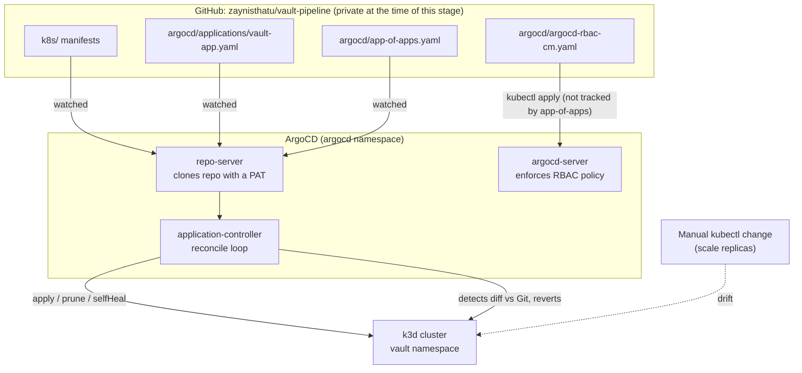
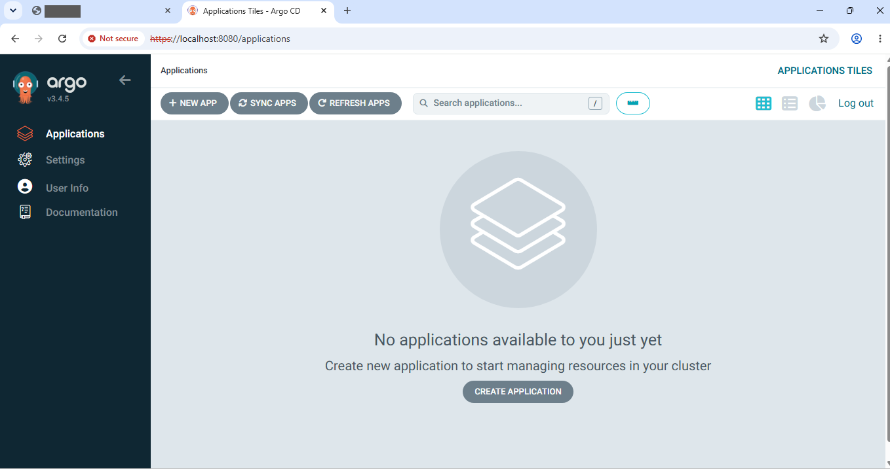
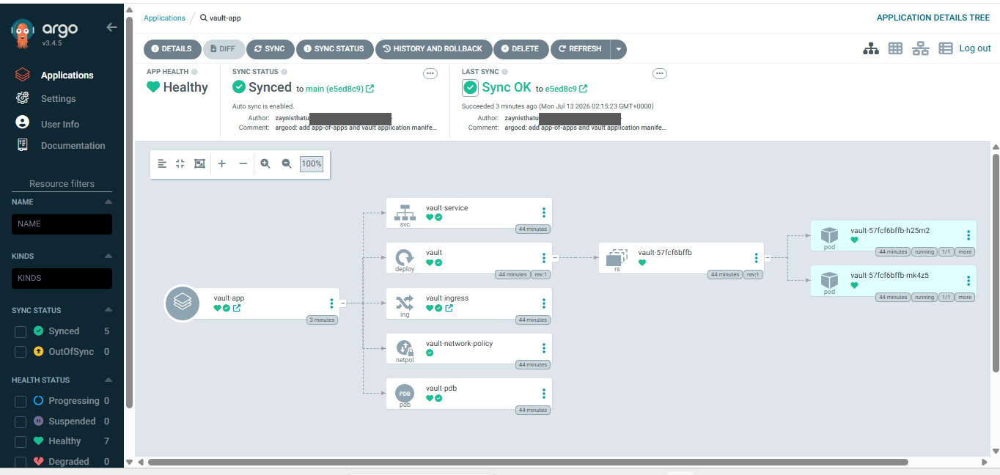
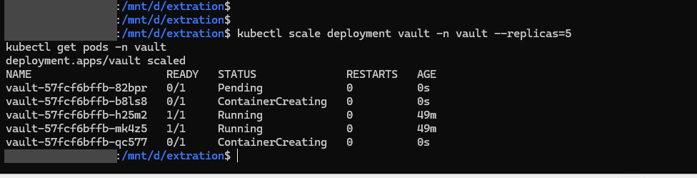
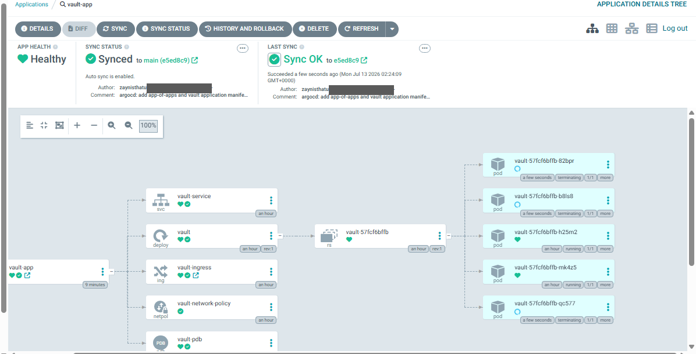
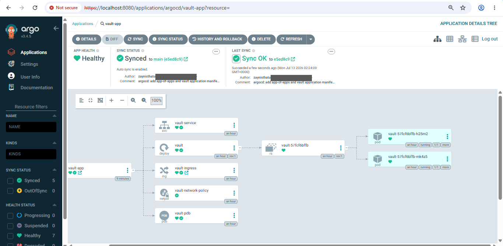
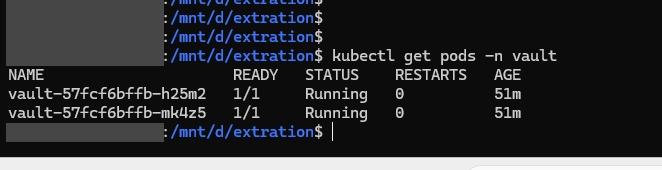
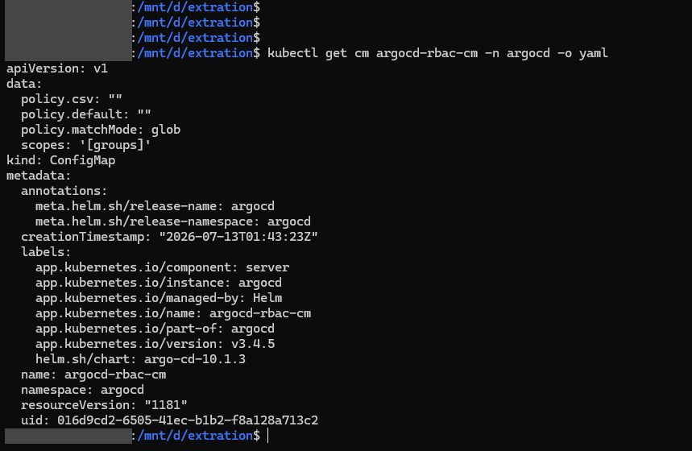
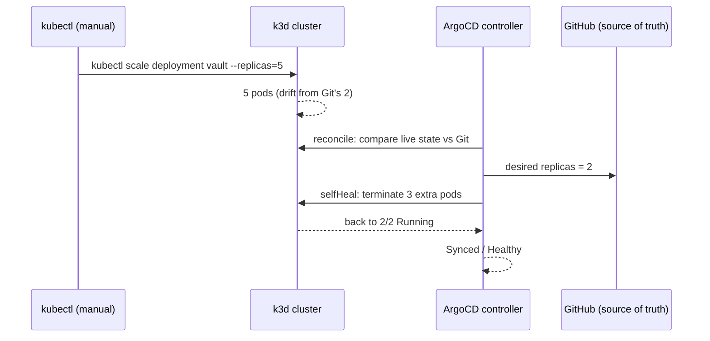

# Stage 3 — GitOps with ArgoCD

**Objective:** Replace manual `kubectl apply` with declarative, Git-driven deployment. Every change to the cluster's desired state flows through a Git commit, and manual drift from that state is detected and reverted by the controller.

**Outcome:** ArgoCD v3.4.5 (Helm chart `argo-cd` 10.1.3) installed on the Stage 2 k3d cluster. An app-of-apps root Application watches `argocd/applications/`; the `vault-app` Application watches `k8s/`. Both run with `prune: true` and `selfHeal: true`. Drift test: a manual `kubectl scale --replicas=5` was reverted to the Git-declared 2 replicas by ArgoCD self-heal, with no sync step in the test. An RBAC ConfigMap was applied and its loaded policy checked with `kubectl`.

---

## Architecture



> ArgoCD watches manifest files in Git, not application source code. Later stages can add more Applications under `argocd/applications/` without restructuring what is already deployed.

---

## Evidence

Terminal screenshots are unedited except that the `user@host` part of the shell prompt is covered with a grey bar. In the ArgoCD UI screenshots the author email and one unrelated browser tab title are covered the same way.

| # | What it shows |
|---|---|
| 1 | ArgoCD UI right after install: no Applications yet |
| 2 | `vault-app` Synced / Healthy: Service, Deployment, Ingress, NetworkPolicy, PDB, 2 pods |
| 3 | Drift trigger: `kubectl scale deployment vault --replicas=5`, three new pods appear |
| 4 | ArgoCD UI seconds later: the 3 extra pods are `terminating`, "Auto sync is enabled" |
| 5 | ArgoCD UI back to 2 pods, Synced / Healthy |
| 6 | Terminal: 2/2 pods Running |
| 7 | RBAC ConfigMap **before** my policy was applied: Helm's default, `policy.csv: ""` |









The RBAC ConfigMap **after** applying `argocd/argocd-rbac-cm.yaml` (`data` section of the terminal output from the same session, not a screenshot):

```
$ kubectl get cm argocd-rbac-cm -n argocd -o yaml
data:
  policy.csv: |
    p, role:developer, applications, sync, */*, allow
    p, role:developer, applications, get, */*, allow
    g, zain, role:developer
  policy.default: role:readonly
  policy.matchMode: glob
  scopes: '[groups]'
```

---

## Engineering Challenges & Resolutions

### Challenge 1 — ArgoCD server pod stuck `Pending`

Right after `helm install argocd`, a port-forward failed with `unable to forward port because pod is not running. Current status=Pending`.

**Root cause:** transient. The images were still being pulled; the pod reached `Running` on its own. The full chart (server, repo-server, application-controller, redis) is heavy enough that a normal image-pull wait is easy to mistake for a resource shortage.

**Resolution:** checked `kubectl get pods -n argocd` again about a minute later; all pods were `1/1 Running`. No resource tuning was needed.

---

### Challenge 2 — Sync dialog gave no usable feedback

Two things in ArgoCD's sync dialog: the **DRY RUN** checkbox had been ticked by mistake, and clicking **all** under "Synchronize resources" produced no visible change, so the dialog looked stuck.

**Root cause:** DRY RUN was my mistake. For the missing feedback I did not find a cause. It may be a UI rendering issue, and I did not investigate it.

**Resolution:** stopped fighting the dialog and used the CLI (`argocd app sync <name>`), which is scriptable and does not depend on reading ambiguous UI state.

---

### Challenge 3 — `argocd login`: `unknown flag: --password ...`

```
argocd login localhost:8080 --username admin --password <value> --insecure
Error: unknown flag: --password <value>
```

**Root cause:** not fully determined. The error text shows the flag and its value read as a single token, so the shell or CLI did not split the arguments the way the command intended. I did not confirm why. The binary was not the problem: it had been installed minutes earlier in the same session, from the official release URL.

**Resolution:** the `=` form worked immediately:
```bash
argocd login localhost:8080 --username=admin --password=<value> --insecure
```

**Lesson:** when a valid flag is reported as unknown, check how the arguments are being tokenized before blaming the binary. `--flag=value` removes the ambiguity.

---

### Challenge 4 — `Repository not found ... authentication required`

The plan assumed the repo was public, so no credentials were configured. After login, the first sync failed:
```
rpc error: code = FailedPrecondition desc = error resolving repo revision:
failed to list refs: authentication required: Repository not found.
```

**Root cause:** the repo is private, so ArgoCD's repo-server had no credentials to clone it. The message reads like a network problem, so I first checked connectivity: `curl -sI` to the repo URL returned a normal HTTP 301, from the VM and from a pod inside the cluster.

**Resolution:** registered the repo with a PAT that has read access to it:
```bash
argocd repo add https://github.com/zaynisthatu/vault-pipeline.git \
  --username zaynisthatu --password <github-pat> \
  --insecure-skip-server-verification
```
`argocd repo list` then showed the repo as `Successful`, and `argocd app sync app-of-apps` created `vault-app`.

---

### Challenge 5 — Repo files "missing" on the VM, and RBAC silently skipped

Two failures with one cause, plus one gap:

```
kubectl apply -f argocd/app-of-apps.yaml
error: the path "argocd/app-of-apps.yaml" does not exist
```
The manifests were written and pushed from the Windows checkout. The VM's shell was in a different directory from the VM's own clone, so the files were not there. `cd ~/vault-pipeline && git pull` fixed it. The same thing happened again with `argocd/argocd-rbac-cm.yaml`.

The RBAC ConfigMap was an explicit Stage 3 deliverable, but it had not been applied. The command had been written down earlier and never confirmed. It only surfaced when I re-checked the deliverables at the end, and `kubectl get cm argocd-rbac-cm -o yaml` showed Helm's empty default (screenshot 7).

Also, the two commands had been run back to back without `&&`, so `kubectl rollout restart` ran even though `kubectl apply` had just failed. It did no harm here, but it would with a less forgiving second command.

**Resolution:** applied from the correct directory, restarted `argocd-server`, and read the ConfigMap back rather than trusting the `configured` message (output above).

**Lesson:** verify each deliverable with a read-back command. Chain dependent commands with `&&`.

---

## Drift Detection: the core GitOps proof



The test: scale to 5 by hand, then watch. Screenshots 3 to 6 show the sequence: five pods, three `terminating`, back to two, Synced / Healthy. The vault-app manifest that makes this possible:

```yaml
syncPolicy:
  automated:
    prune: true
    selfHeal: true
  syncOptions:
    - CreateNamespace=true
```

---

## Engineering Decisions & Rationale

**App-of-apps over flat manifest watching:** one root Application watches a folder. Anything added to that folder becomes a managed Application, so later stages add entries without changing the root.

**CLI over UI for sync operations:** the UI dialog gave ambiguous feedback (Challenge 2). The CLI is deterministic and repeatable across sessions on an ephemeral VM.

**`prune: true` and `selfHeal: true`, not just auto-sync:** auto-sync alone applies new Git changes but does not fix out-of-band edits. With both on, the drift test shows the controller enforcing Git, not a manual chore that looks similar.

**`sync-wave` annotation on `vault-app`:** present so ordering is already in place when other Applications are added. With a single Application it has no effect, and this stage does not demonstrate it.

---

## Local vs Production Equivalents

| Aspect | This setup | Typical production |
|---|---|---|
| GitOps engine | ArgoCD, Helm-installed on k3d | Same ArgoCD (or Flux) on a managed cluster |
| App structure | app-of-apps watching `argocd/applications/` | Same pattern, usually split per cluster or environment |
| Repo auth | HTTPS + PAT via `argocd repo add` | A GitHub App or deploy key with narrower scope |
| Access control | RBAC ConfigMap, one static role | Same mechanism, mapped to SSO/OIDC groups |
| Drift correction | `selfHeal: true` | Same setting |

---

## Known Gaps

- **RBAC was loaded, not exercised.** The policy maps a user `zain` to `role:developer`, but no local account or SSO user named `zain` was created in this stage; I only logged in as the built-in `admin`. So the policy is proven to load, not proven to restrict anyone.
- **No screenshot of the populated RBAC policy.** Screenshot 7 shows the state before my policy was applied. The applied state is shown as terminal output above.
- **Repo credentials are stored as a plain Kubernetes Secret** (base64, not encrypted) in the `argocd` namespace. Sealed Secrets in a later stage is the planned replacement.
- **The drift test was run once**, on one Deployment, on one cluster. Multi-cluster and multi-environment layouts were not exercised.
- **Root causes of two UI/CLI oddities (Challenges 2 and 3) were not determined.** The workarounds are documented, not the causes.
