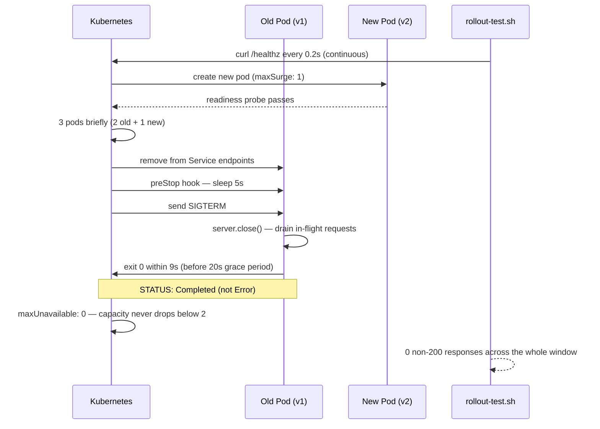

# Stage 4 — Zero-Downtime Rolling Update

**Objective:** Prove that shipping a new version of VAULT through a Kubernetes rolling update doesn't drop a single request — via a correctly wired SIGTERM handler, a rollout strategy that never lets capacity drop, and a live traffic probe running through the actual rollout window.

**Outcome:** Two independent rollout runs — 993 and 1,965 continuous `/healthz` requests — completed with **zero** non-200 responses. The PDB's `Allowed disruptions: 1` was never breached. Old pods terminated cleanly (`Completed`, exit 0) instead of `Error`, once the SIGTERM handler was actually implemented rather than just documented.

---

## Rollout Flow



---

## Engineering Challenges & Resolutions

### Challenge 1 — SIGTERM handler was documented but never actually implemented

Before starting rollout work, an audit of `server.ts` found there was **no `process.on('SIGTERM')` handler at all**, despite graceful shutdown being noted as a Stage 1 deliverable in earlier project notes.

**Root cause:** the handler had been planned/described previously, but the actual code change was never made — a gap between "documented" and "done."

**Resolution:**
```ts
const server = app.listen(PORT, () => { ... });

process.on('SIGTERM', () => {
  server.close(() => process.exit(0));
  setTimeout(() => process.exit(1), 9000); // forced-exit safety net
});
```
`server.close()` stops accepting new connections and lets in-flight requests finish before exiting; the 9-second timeout guarantees the process exits even if a connection somehow never drains, staying comfortably inside the 20-second `terminationGracePeriodSeconds`.

---

### Challenge 2 — Rollout strategy and grace-period timing

`k8s/deployment.yaml` needed three coordinated additions:
```yaml
strategy:
  type: RollingUpdate
  rollingUpdate:
    maxSurge: 1
    maxUnavailable: 0
terminationGracePeriodSeconds: 20
lifecycle:
  preStop:
    exec:
      command: ["sleep", "5"]
```

**Timing math, not arbitrary numbers:** `5s` preStop + up to `9s` app-level close timeout + `6s` buffer = `20s` total — Kubernetes never SIGKILLs the process before it's had a real chance to drain. `maxUnavailable: 0` matters specifically because with only 2 replicas, a percentage-based default (25%) could legally let ready capacity drop to 1 or even 0 — setting it to 0 makes the zero-downtime guarantee explicit in the manifest rather than incidental.

---

### Challenge 3 — `docker build` failed silently, but `docker push` still succeeded with a stale image

```
docker build -t ghcr.io/zaynisthatu/vault-pipeline:latest .
ERROR: failed to build: failed to solve: failed to read dockerfile: open Dockerfile: no such file or directory
docker push ghcr.io/zaynisthatu/vault-pipeline:latest
# ...push completed "successfully" anyway
```

**Root cause:** the build was run from `/mnt/d/extration` — not a clone of the repo, no `Dockerfile` there — so the build step failed outright. But the following `docker push` command doesn't know or care that the build failed; it just pushes whatever image is already tagged `latest` locally, which was the older, pre-fix image. The push "succeeding" was misleading — nothing new had actually shipped.

**Resolution:** caught by noticing the build error preceded a push that shouldn't have had anything new to push. Re-ran both commands from the correct directory (`/home/user/vault-pipeline`). Verified the fix wasn't just "it built without errors" but confirmed the resulting image manifest digest (`sha256:d99bc317...`) matched the already-known-good `v2` digest exactly — proof that `latest` and `v2` are now bit-for-bit identical, not just similarly named.

---

## Rollout Proof — the actual deliverable

- **`scripts/rollout-test.sh`** — a curl loop hitting `/healthz` every 0.2s throughout the rollout, logging timestamp + HTTP status per request, printing a summary on exit (total requests, non-200 count, `ZERO DOWNTIME CONFIRMED`/`DENIED`).
- **Run 1:** 993 requests, 0 non-200 responses.
- **Run 2** (after the full `latest`/`v2` digest match was confirmed): 1,965 requests, 0 non-200 responses.
- **Before/after pod termination status** — the clearest single piece of evidence: pods running the pre-fix image terminated with `STATUS: Error`; pods carrying the SIGTERM fix terminated with `STATUS: Completed` (exit code 0). This is direct behavioral proof the handler works, not just proof the code exists.
- **PDB check during rollout:** `kubectl describe pdb vault-pdb` → `Allowed disruptions: 1`, `Min available: 1` — never breached at any point.
- **Visual confirmation:** a small `v2 · Stage 4` badge added next to the header in `App.tsx`, visible live in the browser — paired with the existing Stage 1 screenshot (no badge) as the before/after comparison. A rollback purely to capture a fresh "before" screenshot was considered and rejected as unnecessary risk to an already-stable deployment.

---

## Engineering Decisions & Rationale

**`maxUnavailable: 0` over the Kubernetes default (25%):** with only 2 replicas, a percentage-based tolerance can legally round down to 0 ready pods — setting it explicitly to 0 turns "hopefully zero downtime" into a guarantee enforced by the manifest itself.

**`preStop: sleep 5` before SIGTERM:** Kubernetes removing a pod from Service endpoints and sending SIGTERM happen asynchronously — without a short delay, there's a race where a pod already deregistered from routing is still mid-request, or a pod still receiving new traffic starts shutting down. The sleep gives kube-proxy/Endpoints time to stop routing new traffic before the app starts draining.

**Continuous curl probe over "eyeballing `kubectl get pods`":** zero downtime is a claim about requests, not pod state — pods can look `Running` while still dropping connections mid-transition. The only honest way to prove it is to actually hit the live service throughout the entire update window and count failures.

**v2 badge instead of a rollback for the before/after shot:** rolling back a stable, already-live deployment purely for a documentation screenshot introduces real risk for no operational benefit — the existing Stage 1 screenshot already shows the pre-badge UI faithfully.

---

## Local vs Production Equivalents

| Aspect | This Setup | Production Equivalent |
|---|---|---|
| Rollout strategy | `RollingUpdate`, `maxSurge:1`/`maxUnavailable:0` on a 2-replica Deployment | Same primitive, typically tuned relative to an HPA-managed replica count |
| Graceful shutdown | `preStop sleep(5)` + SIGTERM handler + 9s app-level timeout | Identical pattern; production often adds a load-balancer deregistration delay on top |
| Rollout trigger | Image tag bump in `k8s/deployment.yaml`, committed to Git, ArgoCD auto-syncs | Same GitOps trigger, usually gated by a CI pipeline before the tag bump lands |
| Live verification | Manual `scripts/rollout-test.sh` curl loop | Automated synthetic monitoring / canary analysis (e.g. Argo Rollouts analysis, Datadog synthetics) |
| Registry hygiene | Rebuilt and confirmed digest match after a bad build/push | Digest-pinned deployments make this exact class of bug harder to hit silently |

---

## Known Gaps

- Verification was a single manual `rollout-test.sh` run per rollout — there's no automated/repeated regression check yet; that belongs to the CI/CD stage.
- Rollback was reasoned about but never actually exercised — no rollout in this stage went wrong enough to require `kubectl rollout undo`, so that path is untested.

Documented here rather than implied as solved, so the pipeline's actual state stays accurate at every stage.

---

## Evidence — Screenshots

| # | Screenshot | What it shows |
|---|---|---|
| 1 | `01-argocd-deployment-prep-synced.png` | ArgoCD — deployment prep, synced before rollout |
| 2 | `02-argocd-before-v2-rollout.png` | ArgoCD state immediately before the v2 rollout |
| 3 | `03-terminal-pods-before-rollout.png` | `kubectl get pods -w` — baseline, 2/2 pods Running |
| 4 | `04-terminal-rollout-test-sh-started.png` | `rollout-test.sh` launched — continuous `/healthz` probe begins |
| 5 | `05-argocd-progressing-during-rollout.png` | ArgoCD — rollout in progress (3 pods briefly: 2 old + 1 new) |
| 6 | `06-terminal-old-pods-error-status-unfixed-image.png` | Old pods terminating with `STATUS: Error` — the pre-fix (no SIGTERM handler) behavior |
| 7 | `07-argocd-healthy-synced-after-v2-rollout.png` | ArgoCD — Healthy/Synced after v2 rollout completes |
| 8 | `08-terminal-pdb-describe-allowed-disruptions.png` | `kubectl describe pdb vault-pdb` — `Allowed disruptions: 1`, never breached |
| 9 | `09-terminal-pods-graceful-shutdown-completed-status.png` | Post-fix rollout — old pods terminate with `STATUS: Completed` (exit 0), not `Error` |
| 10 | `10-argocd-healthy-after-graceful-shutdown-rollout.png` | ArgoCD — Healthy/Synced after the graceful-shutdown-fixed rollout |
| 11 | `11-browser-vault-app-v2-stage4-badge-live.png` | Live browser view — `v2 · Stage 4` badge visible in the running app |

All screenshots in `docs/images/stage-4/` have terminal hostname/path prompts redacted (blacked out) before publishing; commands and output are untouched.
